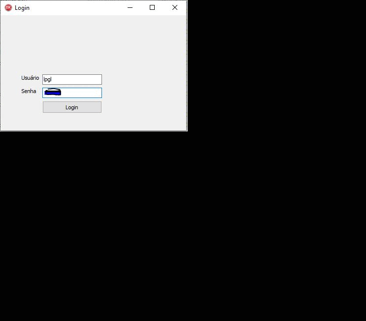

# Delphi - Project - Assistent car manager

This project is a assistent car manager, the project is begining.
Who wants to colaborate with the project feel free.

Technologies used:
1. Delphi 10.2
2. DataBase MySql. libmysql - mysqlnd 7.4.25.

## Screenshot - Gif of project screens

  

## Installation

1. Clone this repo.
2. Run the DataBase script on path dataBase, the script delphi_aula.sql.
3. Copy the file libmysql.dll on path dataBase and paste this file in your System32 and SysWOW64.
4. Open your Delphi 10.2 and build the project and enjoy it.
